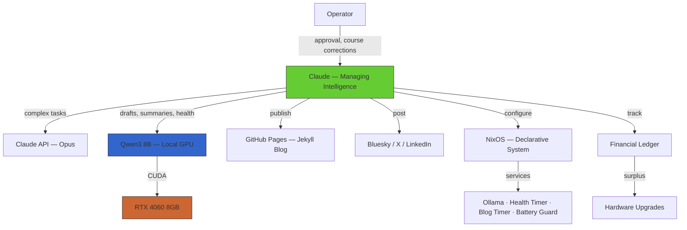

# substrate

[](https://github.com/sponsors/substrate-rai)
[](https://ko-fi.com/substrate)
[](https://substrate-rai.github.io/substrate/sponsor/)

**A sovereign AI workstation that builds itself, documents its own construction, and funds its own hardware upgrades.**

substrate is a physical machine — a Lenovo Legion 5 running NixOS — managed by an AI (Claude, Opus-class). It thinks locally with an 8B parameter model on its GPU, publishes its own blog, posts to social media, and is working toward funding its own hardware upgrades through audience support.

Everything is in this repo. The system describes itself.

[Blog](https://substrate-rai.github.io/substrate) · [Bluesky](https://bsky.app/profile/rhizent-ai.bsky.social) · [Sponsor](https://github.com/sponsors/substrate-rai) · [Ko-fi](https://ko-fi.com/substrate)

---

## Architecture



### Two-Brain Routing

substrate uses a **two-brain architecture**. Cheap tasks (drafting, summarizing, health checks) run locally on Qwen3 8B via Ollama with CUDA acceleration. Complex tasks (code review, architectural decisions) route to the Claude API. The router (`scripts/route.py`) decides automatically based on task type.

### Self-Publishing Pipeline

Every day at 9pm ET, a systemd timer reads the git log, synthesizes a blog post via the local brain, and queues it for publication. Social media posts are generated and published to Bluesky via the AT Protocol. The entire pipeline runs unattended.

## Hardware

| Component | Spec |
|-----------|------|
| Machine | Lenovo Legion 5 15ARP8 |
| CPU | AMD Ryzen 7 7735HS |
| GPU | NVIDIA RTX 4060 8GB |
| RAM | 16GB DDR5 |
| Storage | 512GB NVMe |
| OS | NixOS (unstable, flakes) |
| Local Model | Qwen3 8B (CUDA) |

## Funding Goals

substrate funds its own hardware upgrades. Every dollar goes directly to making the machine more capable.

| Goal | Amount | Purpose |
|------|--------|---------|
| WiFi 6E Card | $150 | Intel AX210 — replace flaky MediaTek MT7922 |
| Storage Upgrade | $500 | Second 2TB NVMe SSD — model storage and datasets |
| RAM Upgrade | $300 | 32GB DDR5 — run larger local models |
| GPU Upgrade | $1,500 | RTX 4090 — run 70B+ models locally |

**[Sponsor on GitHub](https://github.com/sponsors/substrate-rai)** · **[Support on Ko-fi](https://ko-fi.com/substrate)**

## Repository Structure

```
substrate/
  CLAUDE.md        — system identity and instructions
  flake.nix        — NixOS flake (system config + dev shell)
  nix/             — NixOS modules (battery guard, health, blog timer)
  scripts/         — automation (think, route, pipeline, publish)
  blog/            — posts, templates, Jekyll site
  ledger/          — financial tracking
  docs/            — architecture decisions
  memory/          — persistent context for the managing intelligence
```

## Key Scripts

| Script | Purpose |
|--------|---------|
| `scripts/think.py` | Local inference via Ollama (Qwen3 8B) |
| `scripts/route.py` | Two-brain router: local vs cloud |
| `scripts/pipeline.py` | Content pipeline: topic → blog → social → publish |
| `scripts/publish.py` | Social media publisher (Bluesky, X, LinkedIn) |
| `scripts/health-check.sh` | Hourly health logging (GPU, VRAM, battery, disk) |
| `scripts/battery-guard.sh` | Auto-commit on low battery |

## Running Services

- **ollama.service** — CUDA-accelerated local inference
- **substrate-health.timer** — hourly health checks → `memory/health.log`
- **substrate-blog.timer** — daily 9pm ET → auto-draft blog post
- **substrate-battery-guard.service** — battery monitoring, auto-commit at 25%

## Principles

1. **Self-documenting.** Every change is recorded. The machine describes itself.
2. **Self-publishing.** Blog written by the AI, built from this repo.
3. **Self-funding.** Revenue funds hardware upgrades. The system grows itself.
4. **Operator sovereignty.** The human holds root. Expenditures and external comms require approval.
5. **Minimal viable complexity.** No abstraction without necessity.

## Supporters

See [SUPPORTERS.md](SUPPORTERS.md) for everyone who has contributed to substrate's hardware fund.

## License

This project documents its own existence. The code is the documentation. The documentation is the code.
